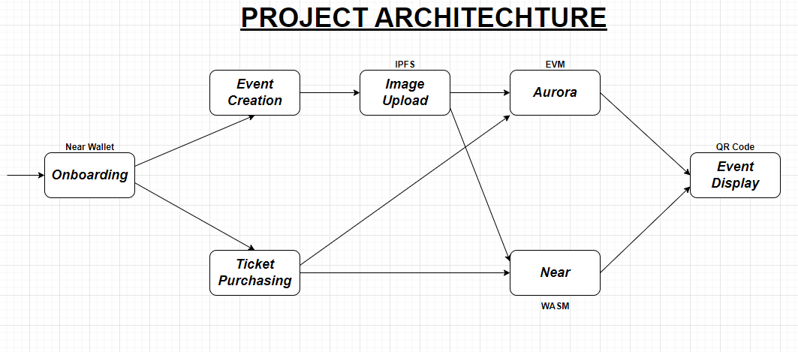

# 🎟️ BlockPass - Revolutionizing Event Ticketing with Blockchain

In an industry plagued by ticket scalping, price manipulation, and counterfeit tickets, **BlockPass** on the **NEAR Blockchain** offers a transformative ticketing solution. BlockPass ensures transparent pricing, security, and fairness through blockchain technology, addressing key challenges in traditional ticketing systems.

### Table of Contents

1. [Introduction](#introduction)
2. [Problem Statement](#problem-statement)
3. [Solution](#solution)
4. [Architecture Overview](#architecture-overview)
5. [Key Features](#key-features)
6. [Motivation](#motivation)
7. [Impact](#impact)
8. [Future Outlook](#future-outlook)
9. [Saving Lives Through Fair Ticketing](#saving-lives-through-fair-ticketing)
10. [Join Us](#join-us)
11. [Additional Resources](#additional-resources)

## Introduction

**Project Overview:**
BlockPass on NEAR is a decentralized event ticketing platform that leverages NFTs to deliver an equitable ticketing solution. Built on NEAR, BlockPass taps into a blockchain ecosystem optimized for scalability, security, and developer flexibility, creating a trusted ticketing experience for both organizers and attendees.

## 🔴 Problem Statement

Traditional event ticketing suffers from problems like excessive pricing, lack of transparency, and widespread ticket counterfeiting. These issues disrupt fan experiences, inflate ticket costs, and erode trust in ticketing platforms.

## 🟢 Solution

BlockPass on NEAR introduces blockchain-based, decentralized ticketing to solve these issues. Utilizing NFTs for ticket issuance, BlockPass promotes fair and transparent pricing, authentic tickets, and scalping prevention.

## 🏦 Architecture Overview

The architecture of BlockPass demonstrates its integration with the NEAR blockchain, handling NFT-based ticket issuance, secure ticket transfers, and transparent transaction records. This decentralized model prevents counterfeiting, scalping, and ensures fair ticket pricing and ownership.

_Figure: BlockPass Architecture on NEAR - showcasing the decentralized ticketing flow, user interactions, and NFT issuance on the NEAR blockchain._

## 🔐 Key Features

1. **Transparent Pricing:** BlockPass offers dynamic and fair pricing, ensuring access to genuine attendees.
2. **NFT-based Access:** Each ticket is a unique NFT on NEAR, enabling secure ownership transfers and eliminating counterfeiting risks.
3. **Immutable Records:** Ticket transactions are recorded on NEAR’s blockchain, ensuring a secure, tamper-proof record of ticket issuance and transfer history.

## ⚡Motivation

The motivation behind BlockPass arises from systemic challenges in ticketing, as highlighted in [this CBC News article](https://www.cbc.ca/news/entertainment/concert-tickets-broken-1.7185987), which outlines issues like scalping, counterfeiting, and unfair pricing. BlockPass was designed to address these issues through transparency, equitable access, and authenticity, creating a better ecosystem for fans and organizers alike.

## Impact

BlockPass on NEAR aims to bring a paradigm shift in event ticketing, promoting fairness and accessibility. By removing intermediaries, reducing fraud, and enabling fair pricing, BlockPass seeks to redefine the industry, placing power back into the hands of fans and event creators.

## Future Outlook

We envision a future where ticketing is fully decentralized, fostering transparency and accessibility. With NEAR’s efficient blockchain infrastructure, BlockPass is poised to scale, bringing reliable and fair ticketing to global audiences.

## Saving Lives Through Fair Ticketing

BlockPass’ impact goes beyond ticket sales. In emergency situations, fair access to event tickets can be a lifeline, ensuring critical information reaches genuine attendees without interference. BlockPass is designed to support a safer, more connected society by ensuring that tickets are only accessible to real fans, enabling clear and timely communication between organizers and attendees.

## Join Us

Ready to be part of the event ticketing revolution? Join BlockPass on NEAR and help shape a fairer, more transparent ticketing experience for all.

---

### Additional Resources

For comprehensive details on deploying and using the BlockPass contract, please refer to the [BlockPass Smart Contract README WASM](./contracts/Near/README.md) | [BlockPass Smart Contract README (EVM)](./contracts/Hardhat/README.md).

---
